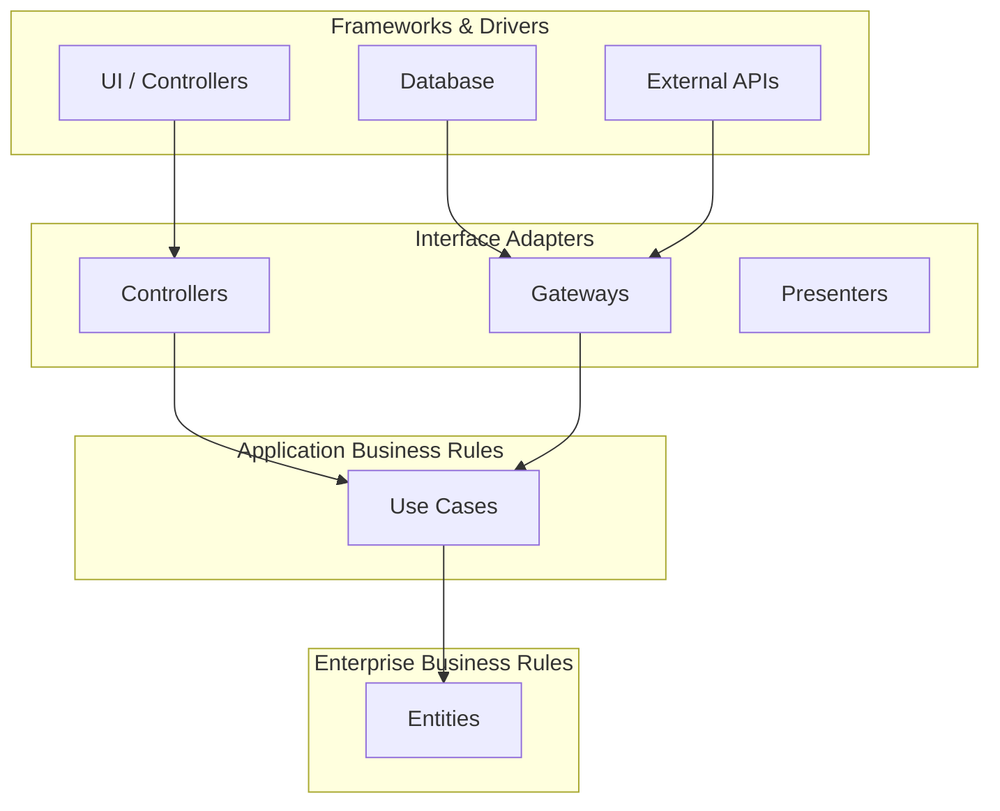
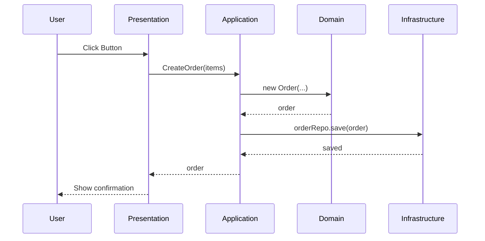

## What is Clean Architecture?

Clean Architecture, proposed by Robert C. Martin, is an architectural style that separates concerns into **concentric circles**, where dependencies point inward.

## The Rings Diagram



## Project Layers

```
src/
├── domain/           # Entities and business rules
│   ├── entities/
│   └── value-objects/
├── application/      # Use cases
│   ├── use-cases/
│   └── dtos/
├── infrastructure/   # External implementations
│   ├── database/
│   ├── api/
│   └── filesystem/
└── presentation/     # UI and controllers
    ├── components/
    └── pages/
```

## Example: Use Case

```typescript
// domain/entities/Order.ts
export class Order {
  constructor(
    public readonly id: string,
    public readonly items: OrderItem[],
    public readonly total: number,
  ) {}
}

// application/use-cases/CreateOrder.ts
export class CreateOrder {
  constructor(private orderRepo: OrderRepository) {}

  async execute(items: OrderItem[]): Promise<Order> {
    const total = items.reduce((sum, item) => sum + item.price, 0);
    const order = new Order(generateId(), items, total);
    await this.orderRepo.save(order);
    return order;
  }
}
```

## Data Flow



## Benefits

- **Testable**: Each layer can be tested in isolation
- **Maintainable**: UI changes don't affect the domain
- **Scalable**: Easy to extend with new features
- **Independent**: Doesn't depend on specific frameworks
