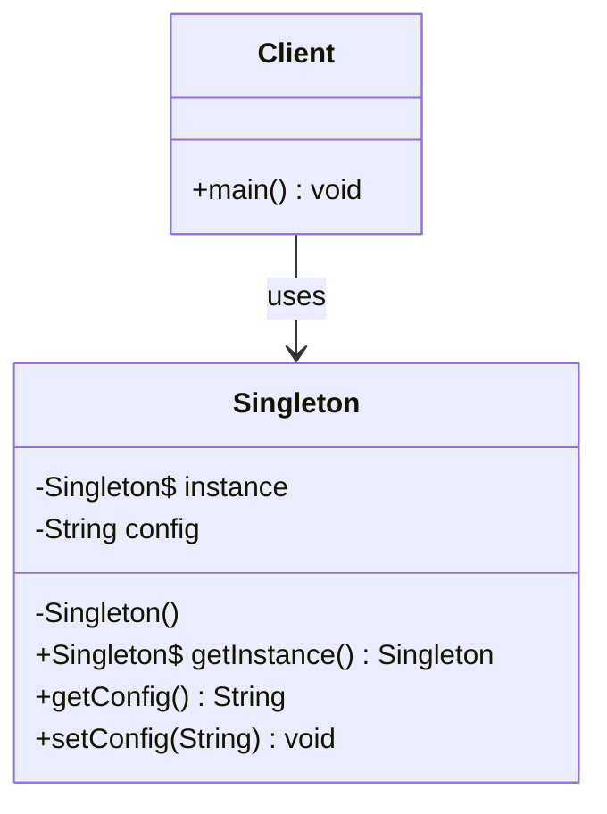
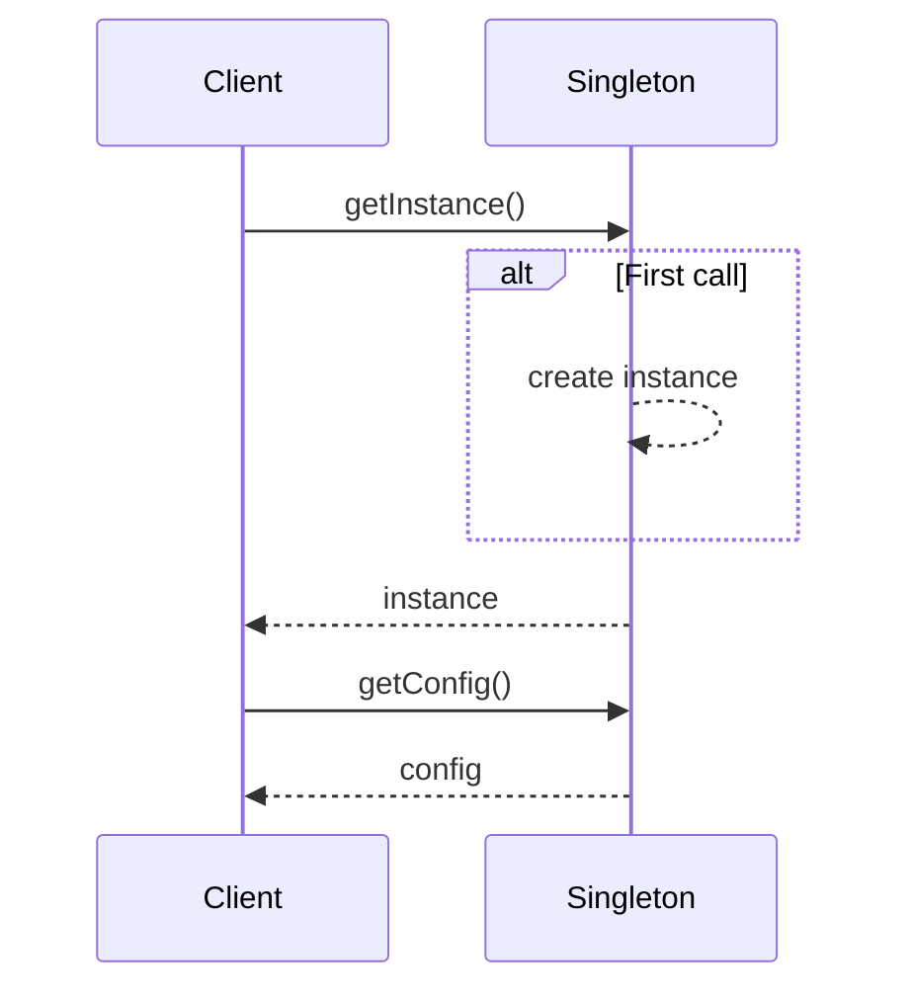
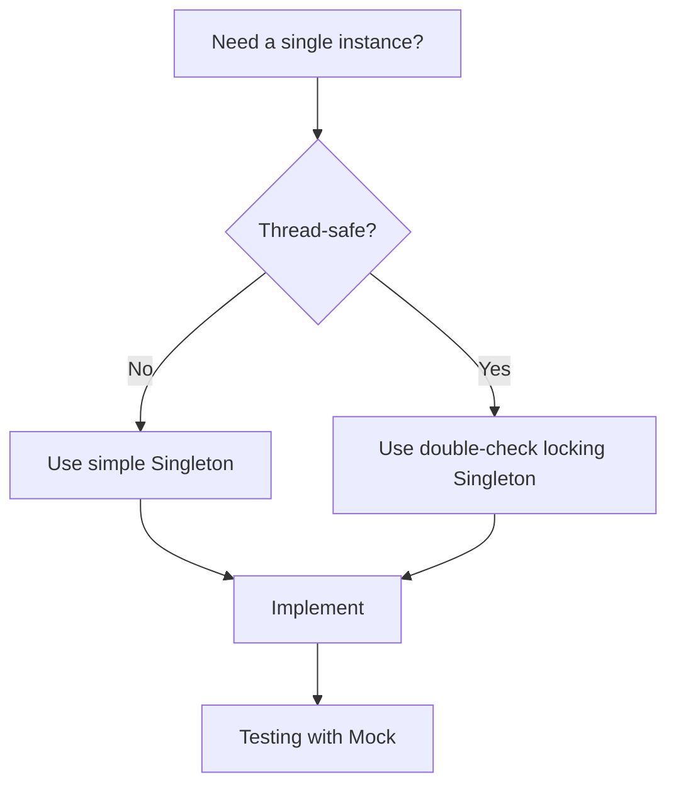

## What is the Singleton?

The Singleton is a **creational** design pattern that ensures a class has only one instance and provides a global access point to it.

## Class Diagram



## Implementation

```typescript
class Singleton {
  private static instance: Singleton;
  private config: string;

  private constructor() {
    this.config = "default";
  }

  public static getInstance(): Singleton {
    if (!Singleton.instance) {
      Singleton.instance = new Singleton();
    }
    return Singleton.instance;
  }

  public getConfig(): string {
    return this.config;
  }

  public setConfig(config: string): void {
    this.config = config;
  }
}
```

## Sequence Diagram



## Use Cases

- Database connection pooling
- Global logger
- Application configuration
- Shared cache

## When to Use?

| Situation                  | Use Singleton    |
| -------------------------- | ---------------- |
| Single instance needed     | ✅               |
| Coordinated global access  | ✅               |
| Multiple instances allowed | ❌               |
| Easy testing required      | ⚠️ (consider DI) |

## Decision Flowchart


