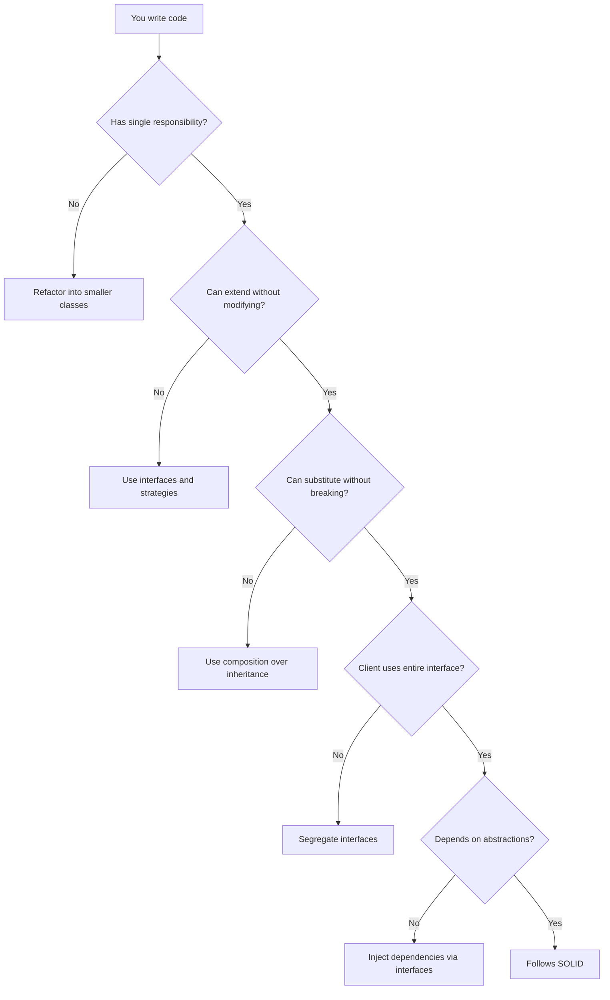

## The Five Principles

SOLID is an acronym grouping five object-oriented design principles proposed by Robert C. Martin. These principles guide the construction of maintainable, flexible, and scalable systems.

## 1. Single Responsibility Principle

> A class should have only one reason to change.

```typescript
// VIOLATION: The class does too many things
class UserManager {
  createUser(data: UserData): User {
    /* ... */
  }
  sendEmail(to: string, subject: string): void {
    /* ... */
  }
  generateReport(users: User[]): string {
    /* ... */
  }
}

// CORRECTION: Each class has one responsibility
class UserService {
  constructor(private userRepo: UserRepository) {}

  createUser(data: UserData): Promise<User> {
    return this.userRepo.save(data);
  }
}

class EmailService {
  constructor(private mailer: Mailer) {}

  sendWelcome(to: string): Promise<void> {
    return this.mailer.send({ to, subject: "Welcome" });
  }
}

class ReportService {
  generateUserReport(users: User[]): string {
    return users.map((u) => `${u.name}: ${u.email}`).join("\n");
  }
}
```

## 2. Open/Closed Principle

> Software entities should be open for extension, but closed for modification.

```typescript
// VIOLATION: Adding a type requires modifying the switch
function calculateDiscount(type: string, amount: number): number {
  switch (type) {
    case "regular":
      return amount * 0.05;
    case "premium":
      return amount * 0.1;
    case "vip":
      return amount * 0.2;
    default:
      return 0;
  }
}

// CORRECTION: Extend without modifying
interface DiscountStrategy {
  calculate(amount: number): number;
}

class RegularDiscount implements DiscountStrategy {
  calculate(amount: number): number {
    return amount * 0.05;
  }
}

class PremiumDiscount implements DiscountStrategy {
  calculate(amount: number): number {
    return amount * 0.1;
  }
}

class VipDiscount implements DiscountStrategy {
  calculate(amount: number): number {
    return amount * 0.2;
  }
}

class DiscountCalculator {
  private strategies: Map<string, DiscountStrategy> = new Map();

  register(type: string, strategy: DiscountStrategy): void {
    this.strategies.set(type, strategy);
  }

  calculate(type: string, amount: number): number {
    const strategy = this.strategies.get(type);
    return strategy ? strategy.calculate(amount) : 0;
  }
}
```

## 3. Liskov Substitution Principle

> Objects of a derived class should be able to substitute objects of the base class without altering program correctness.

```typescript
// VIOLATION: Rectangle cannot be substituted by Square
class Rectangle {
  constructor(
    protected width: number,
    protected height: number,
  ) {}
  setWidth(w: number) {
    this.width = w;
  }
  setHeight(h: number) {
    this.height = h;
  }
  area(): number {
    return this.width * this.height;
  }
}

class Square extends Rectangle {
  setWidth(w: number) {
    this.width = w;
    this.height = w;
  }
  setHeight(h: number) {
    this.width = h;
    this.height = h;
  }
}

// CORRECTION: Use composition instead of inheritance
interface Shape {
  area(): number;
}

class RectangleShape implements Shape {
  constructor(
    private width: number,
    private height: number,
  ) {}
  area(): number {
    return this.width * this.height;
  }
}

class SquareShape implements Shape {
  constructor(private side: number) {}
  area(): number {
    return this.side * this.side;
  }
}

function printArea(shape: Shape): void {
  console.log(`Area: ${shape.area()}`);
}
```

## 4. Interface Segregation Principle

> Clients should not be forced to depend on interfaces they do not use.

```typescript
// VIOLATION: Interface too large
interface Worker {
  work(): void;
  eat(): void;
  sleep(): void;
  code(): void;
}

// CORRECTION: Small, specific interfaces
interface Workable {
  work(): void;
}

interface Eatable {
  eat(): void;
}

interface Sleepable {
  sleep(): void;
}

interface Codeable {
  code(): void;
}

class Developer implements Workable, Sleepable, Codeable {
  work() {
    /* ... */
  }
  sleep() {
    /* ... */
  }
  code() {
    /* ... */
  }
}

class Robot implements Workable, Codeable {
  work() {
    /* ... */
  }
  code() {
    /* ... */
  }
}
```

## 5. Dependency Inversion Principle

> High-level modules should not depend on low-level modules. Both should depend on abstractions.

```typescript
// VIOLATION: Service depends on concrete implementation
class MySQLDatabase {
  query(sql: string) {
    /* ... */
  }
}

class UserService {
  private db = new MySQLDatabase(); // Concrete dependency

  getUser(id: string) {
    return this.db.query(`SELECT * FROM users WHERE id = '${id}'`);
  }
}

// CORRECTION: Both depend on abstractions
interface Database {
  query<T>(sql: string): Promise<T>;
}

class MySQLDatabase implements Database {
  async query<T>(sql: string): Promise<T> {
    /* ... */
  }
}

class PostgresDatabase implements Database {
  async query<T>(sql: string): Promise<T> {
    /* ... */
  }
}

class UserService {
  constructor(private db: Database) {} // Abstract dependency

  async getUser(id: string) {
    return this.db.query<User>(`SELECT * FROM users WHERE id = '${id}'`);
  }
}
```

## Decision Flow



## Summary

| Principle | Rule                          | Tool                         |
| --------- | ----------------------------- | ---------------------------- |
| **S**RP   | One class, one responsibility | Split into services          |
| **O**CP   | Extend without modifying      | Strategy, Plugin system      |
| **L**SP   | Subtype substitutability      | Composition over inheritance |
| **I**SP   | Small interfaces              | Interface segregation        |
| **D**IP   | Depend on abstractions        | Dependency injection         |
