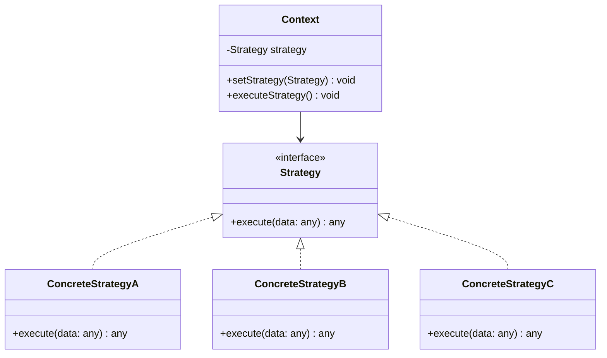
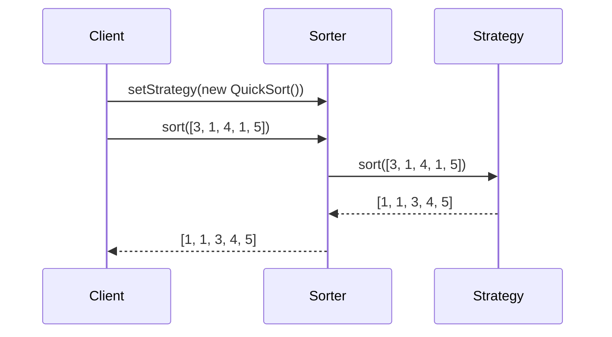
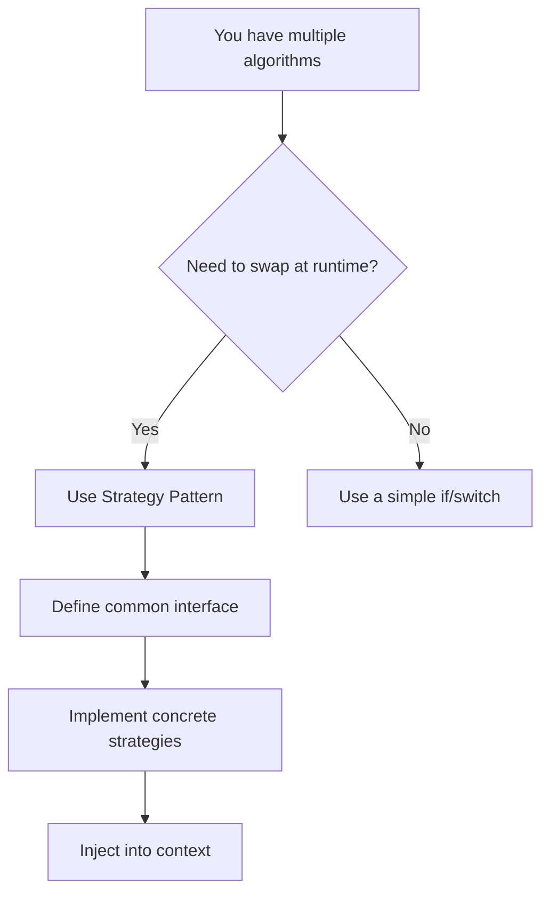

## Definition

The Strategy Pattern is a **behavioral** design pattern that defines a family of algorithms, encapsulates each one in an independent class, and makes them interchangeable at runtime.

## Class Diagram



## Implementation

```typescript
// Strategy definition
interface SortStrategy {
  sort(data: number[]): number[];
}

// Concrete strategies
class BubbleSort implements SortStrategy {
  sort(data: number[]): number[] {
    const arr = [...data];
    for (let i = 0; i < arr.length; i++) {
      for (let j = 0; j < arr.length - i - 1; j++) {
        if (arr[j] > arr[j + 1]) {
          [arr[j], arr[j + 1]] = [arr[j + 1], arr[j]];
        }
      }
    }
    return arr;
  }
}

class QuickSort implements SortStrategy {
  sort(data: number[]): number[] {
    if (data.length <= 1) return data;
    const pivot = data[0];
    const left = data.slice(1).filter((x) => x <= pivot);
    const right = data.slice(1).filter((x) => x > pivot);
    return [...this.sort(left), pivot, ...this.sort(right)];
  }
}

class MergeSort implements SortStrategy {
  sort(data: number[]): number[] {
    if (data.length <= 1) return data;
    const mid = Math.floor(data.length / 2);
    const left = this.sort(data.slice(0, mid));
    const right = this.sort(data.slice(mid));
    return this.merge(left, right);
  }

  private merge(left: number[], right: number[]): number[] {
    const result: number[] = [];
    let i = 0,
      j = 0;
    while (i < left.length && j < right.length) {
      if (left[i] <= right[j]) {
        result.push(left[i++]);
      } else {
        result.push(right[j++]);
      }
    }
    return result.concat(left.slice(i), right.slice(j));
  }
}

// Context
class Sorter {
  private strategy: SortStrategy;

  constructor(strategy: SortStrategy) {
    this.strategy = strategy;
  }

  setStrategy(strategy: SortStrategy): void {
    this.strategy = strategy;
  }

  sort(data: number[]): number[] {
    return this.strategy.sort(data);
  }
}
```

## Sequence Diagram



## Usage

```typescript
const data = [3, 1, 4, 1, 5, 9, 2, 6];

const sorter = new Sorter(new BubbleSort());
console.log(sorter.sort(data)); // [1, 1, 2, 3, 4, 5, 6, 9]

// Swap strategy at runtime
sorter.setStrategy(new QuickSort());
console.log(sorter.sort(data)); // [1, 1, 2, 3, 4, 5, 6, 9]
```

## Use Cases

- Interchangeable sorting algorithms
- Data validation strategies
- Payment methods in e-commerce
- Image compression algorithms
- Cache strategies (LRU, FIFO, TTL)

## Decision


