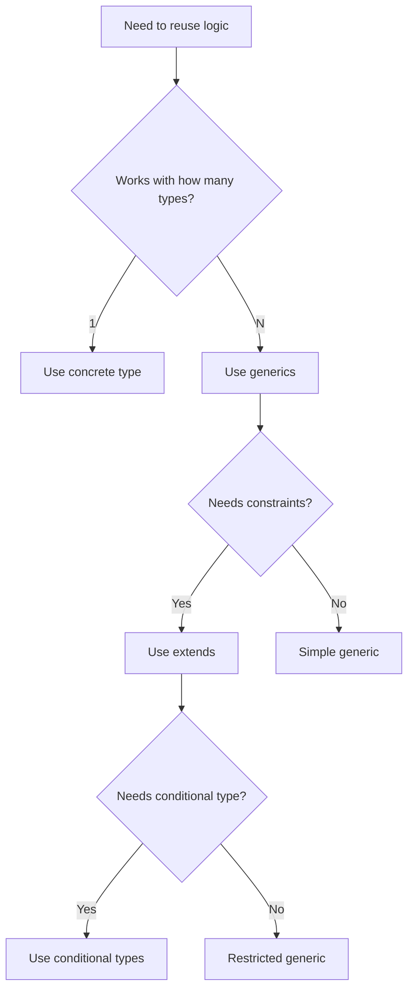

## What Are Generics

Generics allow creating reusable components that work with multiple types while maintaining type safety. They are the equivalent of type parameters instead of value parameters.

## Fundamentals

```typescript
// Basic generic function
function identity<T>(value: T): T {
  return value;
}

const num = identity(42); // type: number
const str = identity("hello"); // type: string
const arr = identity([1, 2, 3]); // type: number[]
```

## Constraints with extends

```typescript
// Restrict generics to certain properties
interface HasLength {
  length: number;
}

function logLength<T extends HasLength>(value: T): T {
  console.log(`Length: ${value.length}`);
  return value;
}

logLength("hello"); // OK: string has .length
logLength([1, 2, 3]); // OK: array has .length
logLength({ length: 10 }); // OK: has .length
// logLength(42);         // ERROR: number has no .length
```

## Generics in Interfaces

```typescript
// Generic container
interface Container<T> {
  value: T;
  getValue(): T;
  setValue(value: T): void;
}

class NumberContainer implements Container<number> {
  constructor(private _value: number) {}

  get value(): number {
    return this._value;
  }
  getValue(): number {
    return this._value;
  }
  setValue(value: number): void {
    this._value = value;
  }
}

// Generic API Response
interface ApiResponse<T> {
  data: T;
  status: number;
  message: string;
  timestamp: Date;
}

interface User {
  id: string;
  name: string;
  email: string;
}

async function fetchUser(id: string): Promise<ApiResponse<User>> {
  const response = await fetch(`/api/users/${id}`);
  return response.json();
}

const result = await fetchUser("123");
// result.data is type User
```

## Generics in Classes

```typescript
// Generic Stack
class Stack<T> {
  private items: T[] = [];

  push(item: T): void {
    this.items.push(item);
  }

  pop(): T | undefined {
    return this.items.pop();
  }

  peek(): T | undefined {
    return this.items[this.items.length - 1];
  }

  isEmpty(): boolean {
    return this.items.length === 0;
  }

  size(): number {
    return this.items.length;
  }
}

const numberStack = new Stack<number>();
numberStack.push(1);
numberStack.push(2);
// numberStack.push("3"); // ERROR: string not assignable to number
```

## Restricted Generics

```typescript
// Get type of nested property
type NestedValue<T, K extends keyof T> = T[K];

interface User {
  name: string;
  address: {
    city: string;
    zip: string;
  };
}

type UserName = NestedValue<User, "name">; // string
type UserCity = NestedValue<User, "address">; // { city: string; zip: string }

// Generic with keyof
function getProperty<T, K extends keyof T>(obj: T, key: K): T[K] {
  return obj[key];
}

const user: User = { name: "John", address: { city: "NY", zip: "10001" } };
const name = getProperty(user, "name"); // string
const city = getProperty(user, "address"); // { city: string; zip: string }
```

## Conditional Types

```typescript
// Conditional type
type IsString<T> = T extends string ? true : false;

type A = IsString<"hello">; // true
type B = IsString<42>; // false

// Extract return type of function
type ReturnOf<T> = T extends (...args: any[]) => infer R ? R : never;

function createUser() {
  return { id: 1, name: "John" };
}

type UserType = ReturnOf<typeof createUser>; // { id: number; name: string }

// Unwrap Promise type
type UnwrapPromise<T> = T extends Promise<infer U> ? U : T;

type Result = UnwrapPromise<Promise<string>>; // string
type Plain = UnwrapPromise<number>; // number
```

## Mapped Types with Generics

```typescript
// Make all properties optional
type Partial<T> = {
  [P in keyof T]?: T[P];
};

// Make all properties required
type Required<T> = {
  [P in keyof T]-?: T[P];
};

// Make all properties readonly
type Readonly<T> = {
  readonly [P in keyof T]: T[P];
};

interface Config {
  host: string;
  port: number;
  debug: boolean;
}

type PartialConfig = Partial<Config>;
// { host?: string; port?: number; debug?: boolean }

type ReadonlyConfig = Readonly<Config>;
// { readonly host: string; readonly port: number; readonly debug: boolean }
```

## Builder Pattern with Generics

```typescript
class QueryBuilder<T extends Record<string, unknown>> {
  private filters: Partial<T> = {};
  private _limit = 10;
  private _offset = 0;

  where<K extends keyof T>(key: K, value: T[K]): this {
    this.filters[key] = value;
    return this;
  }

  limit(n: number): this {
    this._limit = n;
    return this;
  }

  offset(n: number): this {
    this._offset = n;
    return this;
  }

  build(): { filters: Partial<T>; limit: number; offset: number } {
    return { filters: this.filters, limit: this._limit, offset: this._offset };
  }
}

// Type-safe usage
interface UserFilter {
  name: string;
  email: string;
  age: number;
}

const query = new QueryBuilder<UserFilter>()
  .where("name", "John")
  .where("age", 30)
  .limit(20)
  .build();
```

## Decision Flow


