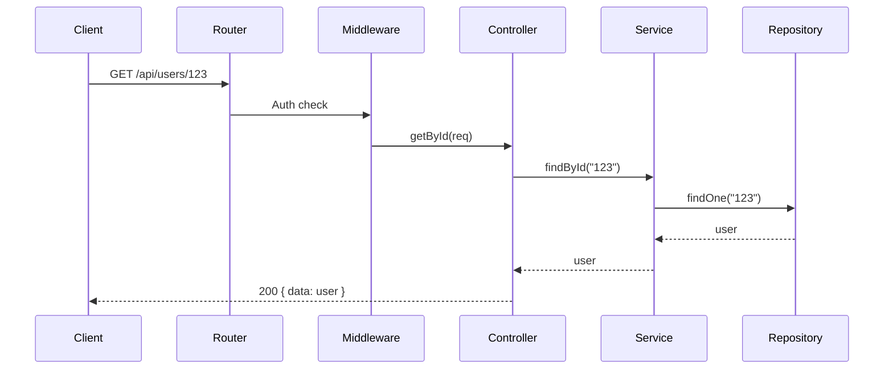
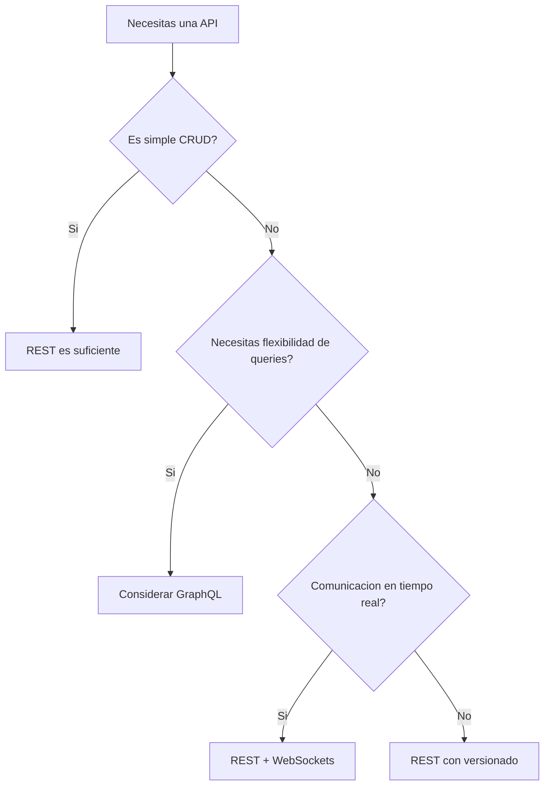

## Fundamentos de REST

REST (Representational State Transfer) es un estilo arquitectonico para disenar servicios web. Una API REST bien diseniada utiliza los verbos HTTP de forma semantica y recursos identificables por URIs.

## Arquitectura del Proyecto

```
src/
├── routes/
│   ├── users.routes.ts
│   ├── posts.routes.ts
│   └── index.ts
├── controllers/
│   ├── users.controller.ts
│   └── posts.controller.ts
├── services/
│   ├── users.service.ts
│   └── posts.service.ts
├── repositories/
│   ├── users.repository.ts
│   └── posts.repository.ts
├── middleware/
│   ├── auth.middleware.ts
│   ├── validation.middleware.ts
│   └── error.middleware.ts
├── dto/
│   ├── create-user.dto.ts
│   └── update-user.dto.ts
└── app.ts
```

## Convenciones de Endpoints

```typescript
// GET    /api/users          → Listar todos
// GET    /api/users/:id      → Obtener uno
// POST   /api/users          → Crear
// PUT    /api/users/:id      → Actualizar completo
// PATCH  /api/users/:id      → Actualizar parcial
// DELETE /api/users/:id      → Eliminar

// GET    /api/users/:id/posts → Posts de un usuario (recurso anidado)
```

## Implementacion con Express

```typescript
// routes/users.routes.ts
import { Router } from "express";
import { UsersController } from "../controllers/users.controller";
import { validate } from "../middleware/validation.middleware";
import { CreateUserDto } from "../dto/create-user.dto";
import { UpdateUserDto } from "../dto/update-user.dto";

const router = Router();
const controller = new UsersController();

router.get("/", controller.list);
router.get("/:id", controller.getById);
router.post("/", validate(CreateUserDto), controller.create);
router.put("/:id", validate(UpdateUserDto), controller.update);
router.patch("/:id", controller.partialUpdate);
router.delete("/:id", controller.remove);

export default router;
```

```typescript
// controllers/users.controller.ts
import { Request, Response, NextFunction } from "express";
import { UsersService } from "../services/users.service";

const service = new UsersService();

export class UsersController {
  async list(req: Request, res: Response, next: NextFunction) {
    try {
      const { page = 1, limit = 20, search } = req.query;
      const result = await service.findAll({
        page: Number(page),
        limit: Number(limit),
        search: search as string,
      });
      res.json({
        data: result.users,
        pagination: {
          page: result.page,
          limit: result.limit,
          total: result.total,
          pages: result.pages,
        },
      });
    } catch (error) {
      next(error);
    }
  }

  async getById(req: Request, res: Response, next: NextFunction) {
    try {
      const user = await service.findById(req.params.id);
      if (!user) {
        return res.status(404).json({ error: "User not found" });
      }
      res.json({ data: user });
    } catch (error) {
      next(error);
    }
  }

  async create(req: Request, res: Response, next: NextFunction) {
    try {
      const user = await service.create(req.body);
      res.status(201).json({ data: user });
    } catch (error) {
      next(error);
    }
  }

  async update(req: Request, res: Response, next: NextFunction) {
    try {
      const user = await service.update(req.params.id, req.body);
      if (!user) {
        return res.status(404).json({ error: "User not found" });
      }
      res.json({ data: user });
    } catch (error) {
      next(error);
    }
  }

  async partialUpdate(req: Request, res: Response, next: NextFunction) {
    try {
      const user = await service.update(req.params.id, req.body);
      if (!user) {
        return res.status(404).json({ error: "User not found" });
      }
      res.json({ data: user });
    } catch (error) {
      next(error);
    }
  }

  async remove(req: Request, res: Response, next: NextFunction) {
    try {
      const deleted = await service.remove(req.params.id);
      if (!deleted) {
        return res.status(404).json({ error: "User not found" });
      }
      res.status(204).send();
    } catch (error) {
      next(error);
    }
  }
}
```

## Middleware de Error

```typescript
// middleware/error.middleware.ts
import { Request, Response, NextFunction } from "express";

interface AppError extends Error {
  statusCode?: number;
  code?: string;
}

export function errorHandler(err: AppError, req: Request, res: Response, _next: NextFunction) {
  const statusCode = err.statusCode || 500;
  const message = err.message || "Internal Server Error";

  console.error(`[${req.method}] ${req.path} → ${statusCode}: ${message}`);

  res.status(statusCode).json({
    error: {
      message,
      code: err.code || "INTERNAL_ERROR",
      ...(process.env.NODE_ENV === "development" && { stack: err.stack }),
    },
  });
}
```

## Respuestas Estandarizadas

```typescript
// Estructura de respuesta exitosa
{
  "data": { ... },
  "pagination": {
    "page": 1,
    "limit": 20,
    "total": 100,
    "pages": 5
  }
}

// Estructura de error
{
  "error": {
    "message": "User not found",
    "code": "USER_NOT_FOUND"
  }
}
```

## Flujo de Request



## Buenas Practicas

| Practica                   | Descripcion                                                                     |
| -------------------------- | ------------------------------------------------------------------------------- |
| Usar verbos HTTP correctos | GET para leer, POST para crear, PUT/PATCH para actualizar, DELETE para eliminar |
| Naming plural              | `/users` no `/user`                                                             |
| Status codes adecuados     | 200 OK, 201 Created, 204 No Content, 404 Not Found, 500 Error                   |
| Paginacion                 | Siempre paginar listas grandes                                                  |
| Versionado                 | `/api/v1/users` para cambios breaking                                           |
| Validacion                 | Validar input con DTOs o schemas                                                |
| Error handling             | Middleware centralizado de errores                                              |

## Decision


