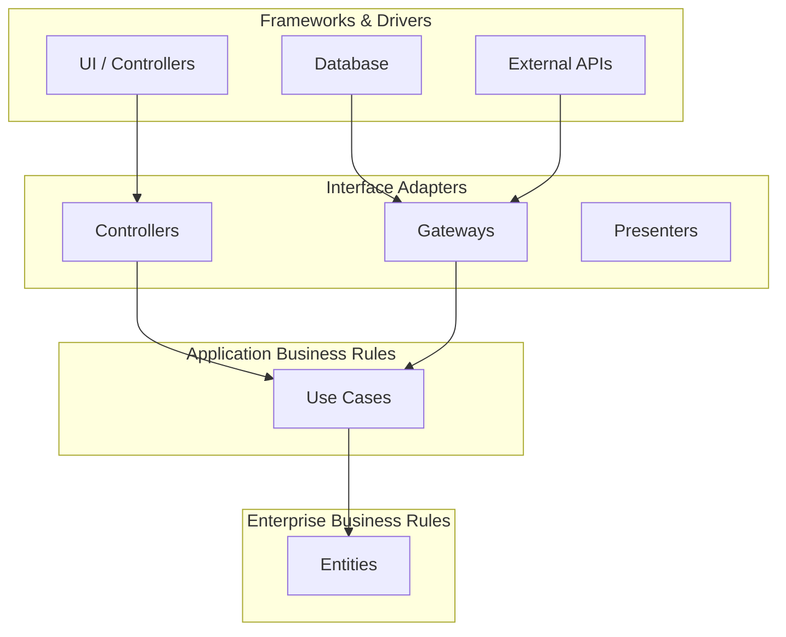
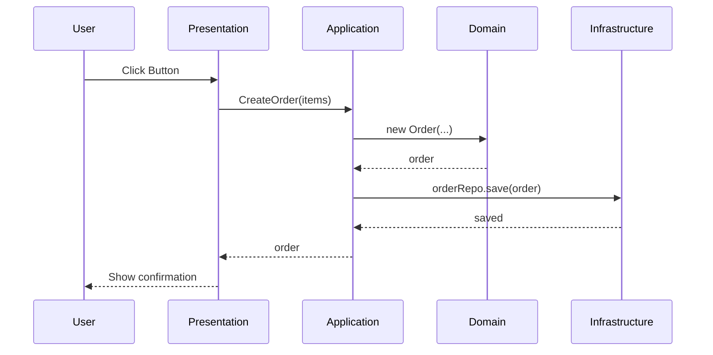

## ¿Qué es Clean Architecture?

Clean Architecture, propuesta por Robert C. Martin, es un estilo arquitectónico que separa concerns en **concentric circles**, donde las dependencias apuntan hacia adentro.

## El Diagrama de los Anillos



## Capas del Proyecto

```
src/
├── domain/           # Entidades y reglas de negocio
│   ├── entities/
│   └── value-objects/
├── application/      # Casos de uso
│   ├── use-cases/
│   └── dtos/
├── infrastructure/   # Implementaciones externas
│   ├── database/
│   ├── api/
│   └── filesystem/
└── presentation/     # UI y controladores
    ├── components/
    └── pages/
```

## Ejemplo: Use Case

```typescript
// domain/entities/Order.ts
export class Order {
  constructor(
    public readonly id: string,
    public readonly items: OrderItem[],
    public readonly total: number,
  ) {}
}

// application/use-cases/CreateOrder.ts
export class CreateOrder {
  constructor(private orderRepo: OrderRepository) {}

  async execute(items: OrderItem[]): Promise<Order> {
    const total = items.reduce((sum, item) => sum + item.price, 0);
    const order = new Order(generateId(), items, total);
    await this.orderRepo.save(order);
    return order;
  }
}
```

## Flujo de Datos



## Beneficios

- **Testeable**: Cada capa se puede testear de forma aislada
- **Maintainable**: Los cambios en UI no afectan el dominio
- **Scalable**: Fácil de extender con nuevas funcionalidades
- **Independiente**: No depende de frameworks específicos
