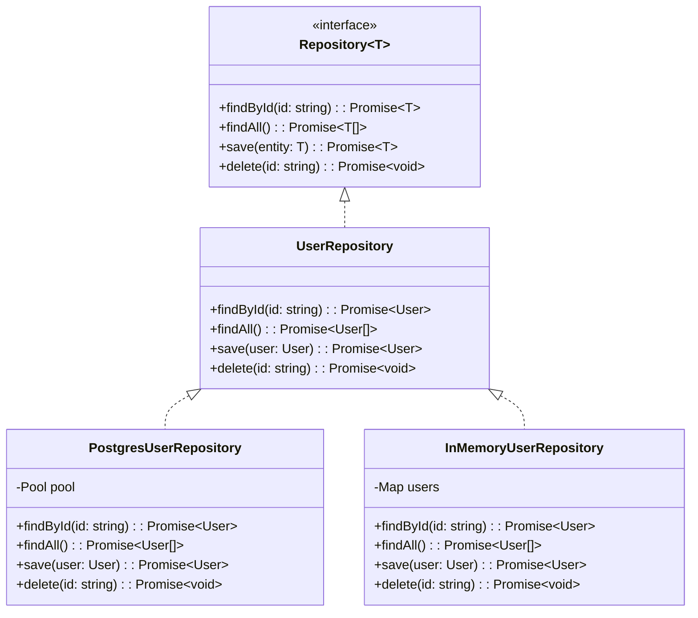
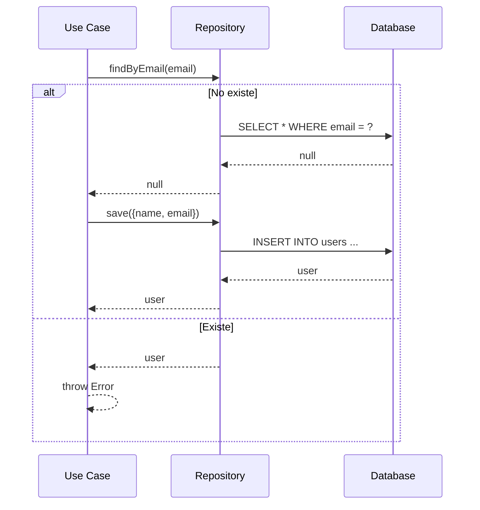
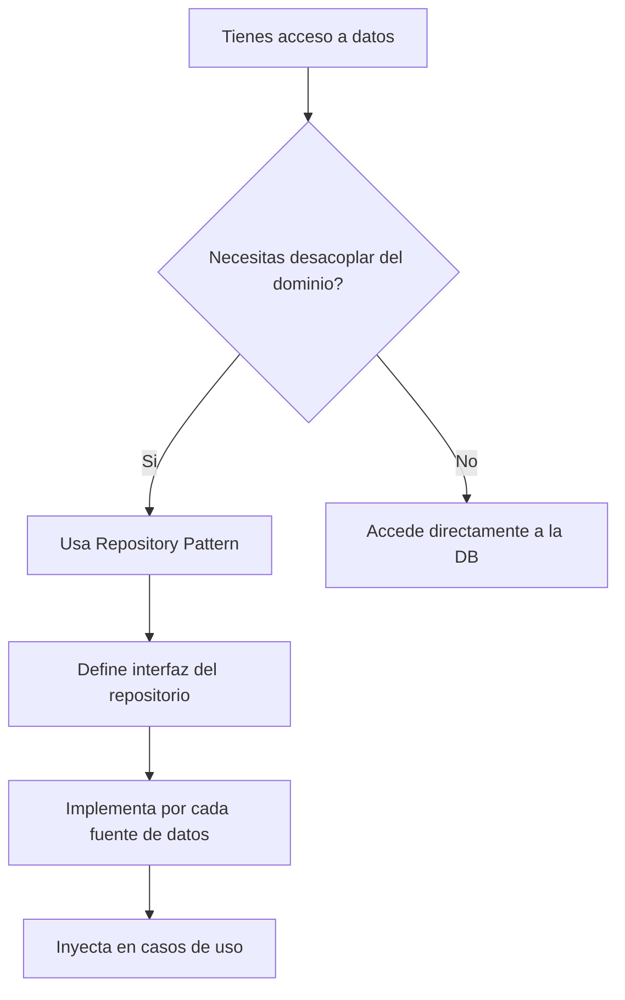

## Definicion

El Repository Pattern es un patron arquitectonico que **abstrae la capa de acceso a datos** detrás de una interfaz, permitiendo que la logica de negocio no dependa de la implementacion especifica de la persistencia.

## Diagrama de Clases



## Implementacion

```typescript
// Entidad
interface User {
  id: string;
  name: string;
  email: string;
  createdAt: Date;
}

// Interfaz del repositorio
interface UserRepository {
  findById(id: string): Promise<User | null>;
  findAll(): Promise<User[]>;
  save(user: Omit<User, "id" | "createdAt">): Promise<User>;
  delete(id: string): Promise<void>;
  findByEmail(email: string): Promise<User | null>;
}

// Implementacion en memoria (para testing)
class InMemoryUserRepository implements UserRepository {
  private users: Map<string, User> = new Map();

  async findById(id: string): Promise<User | null> {
    return this.users.get(id) ?? null;
  }

  async findAll(): Promise<User[]> {
    return Array.from(this.users.values());
  }

  async save(data: Omit<User, "id" | "createdAt">): Promise<User> {
    const user: User = {
      ...data,
      id: crypto.randomUUID(),
      createdAt: new Date(),
    };
    this.users.set(user.id, user);
    return user;
  }

  async delete(id: string): Promise<void> {
    this.users.delete(id);
  }

  async findByEmail(email: string): Promise<User | null> {
    return Array.from(this.users.values()).find((u) => u.email === email) ?? null;
  }
}

// Implementacion con PostgreSQL
class PostgresUserRepository implements UserRepository {
  constructor(private pool: Pool) {}

  async findById(id: string): Promise<User | null> {
    const result = await this.pool.query("SELECT * FROM users WHERE id = $1", [id]);
    return result.rows[0] ?? null;
  }

  async findAll(): Promise<User[]> {
    const result = await this.pool.query("SELECT * FROM users");
    return result.rows;
  }

  async save(data: Omit<User, "id" | "createdAt">): Promise<User> {
    const result = await this.pool.query(
      "INSERT INTO users (name, email) VALUES ($1, $2) RETURNING *",
      [data.name, data.email],
    );
    return result.rows[0];
  }

  async delete(id: string): Promise<void> {
    await this.pool.query("DELETE FROM users WHERE id = $1", [id]);
  }

  async findByEmail(email: string): Promise<User | null> {
    const result = await this.pool.query("SELECT * FROM users WHERE email = $1", [email]);
    return result.rows[0] ?? null;
  }
}
```

## Uso con Inyeccion de Dependencias

```typescript
// Caso de uso que depende de la interfaz, no de la implementacion
class RegisterUser {
  constructor(private userRepo: UserRepository) {}

  async execute(name: string, email: string): Promise<User> {
    const existing = await this.userRepo.findByEmail(email);
    if (existing) {
      throw new Error("Email already registered");
    }
    return this.userRepo.save({ name, email });
  }
}

// En produccion
const pgRepo = new PostgresUserRepository(pool);
const registerUser = new RegisterUser(pgRepo);

// En testing
const mockRepo = new InMemoryUserRepository();
const registerUserTest = new RegisterUser(mockRepo);
```

## Flujo de Datos



## Beneficios

- **Desacoplamiento**: La logica de negocio no conoce la base de datos
- **Testeable**: Se puede usar un repositorio en memoria para tests
- **Intercambiable**: Cambiar de PostgreSQL a MongoDB sin tocar el dominio
- **Single Responsibility**: Cada repositorio gestiona una entidad

## Decision


