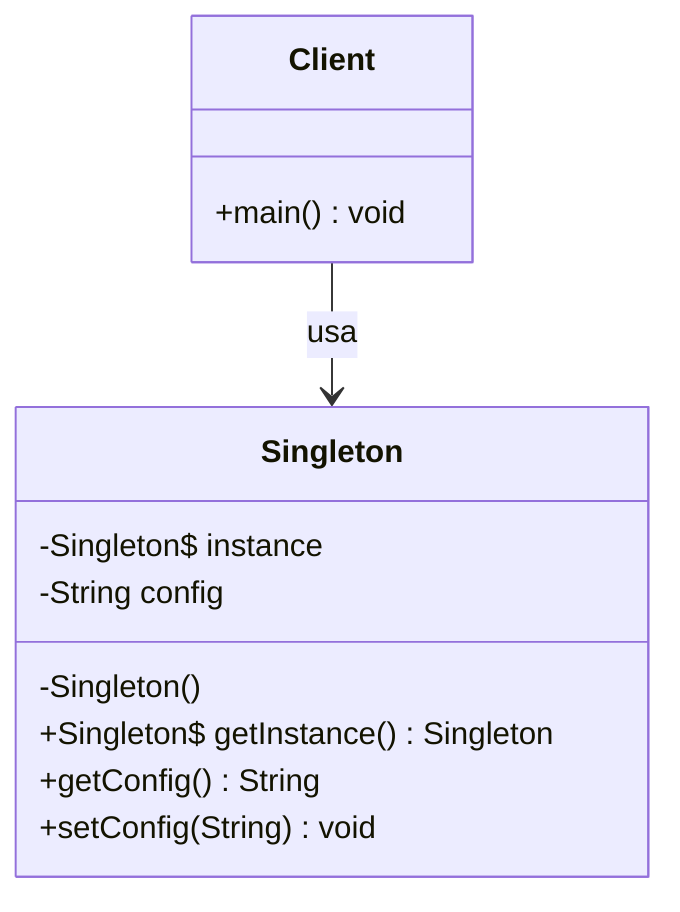
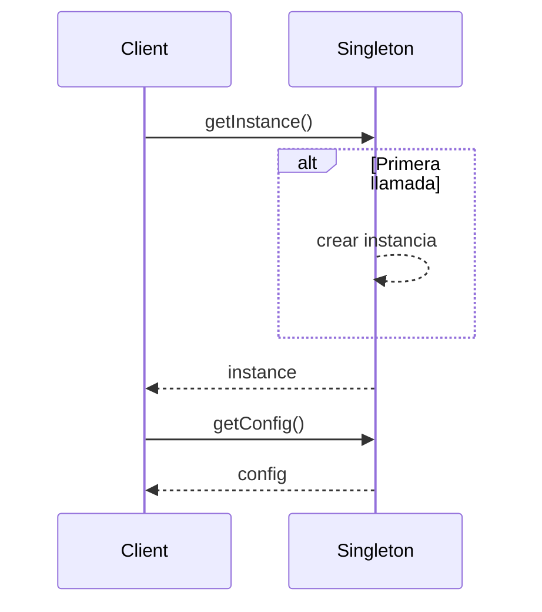
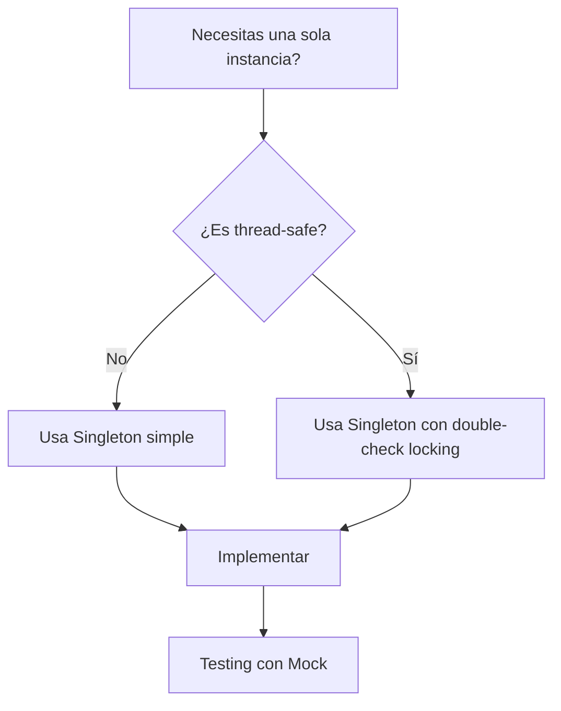

## ¿Qué es el Singleton?

El Singleton es un patrón de diseño **creacional** que garantiza que una clase tenga una única instancia y proporciona un punto de acceso global a ella.

## Diagrama de Clases



## Implementación

```typescript
class Singleton {
  private static instance: Singleton;
  private config: string;

  private constructor() {
    this.config = "default";
  }

  public static getInstance(): Singleton {
    if (!Singleton.instance) {
      Singleton.instance = new Singleton();
    }
    return Singleton.instance;
  }

  public getConfig(): string {
    return this.config;
  }

  public setConfig(config: string): void {
    this.config = config;
  }
}
```

## Diagrama de Secuencia



## Casos de Uso

- Conexión a base de datos
- Logger global
- Configuración de la aplicación
- Cache compartida

## ¿Cuándo Usar?

| Situación                       | Usar Singleton     |
| ------------------------------- | ------------------ |
| Una sola instancia necesaria    | ✅                 |
| Acceso global coordinado        | ✅                 |
| Múltiples instancias permitidas | ❌                 |
| Testing fácil requerido         | ⚠️ (considerar DI) |

## Flujograma de Decisión


